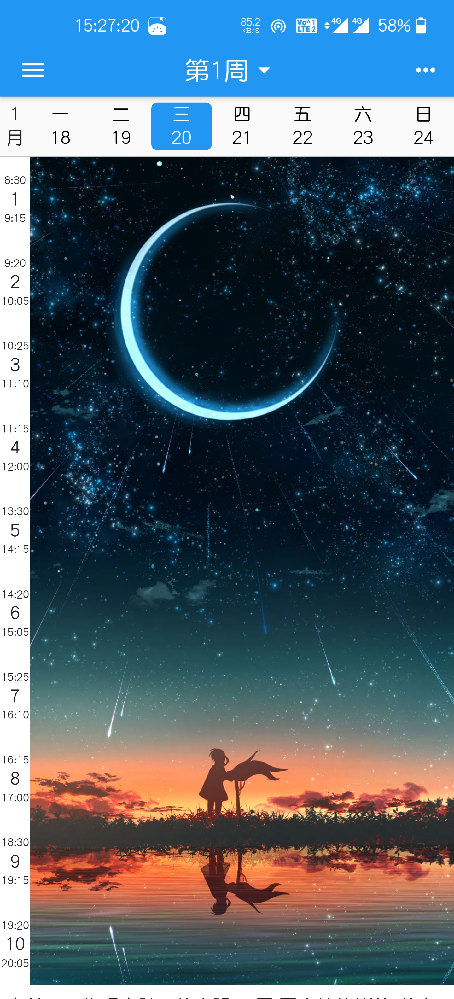
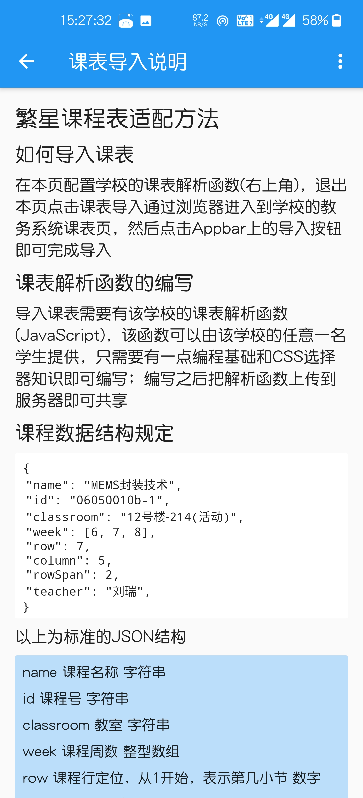
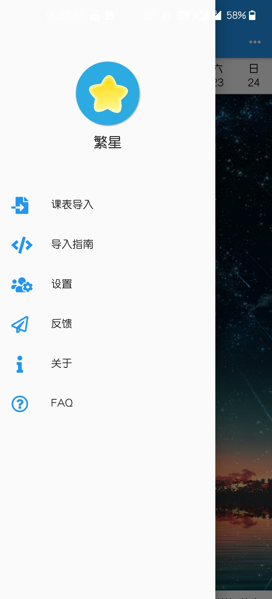
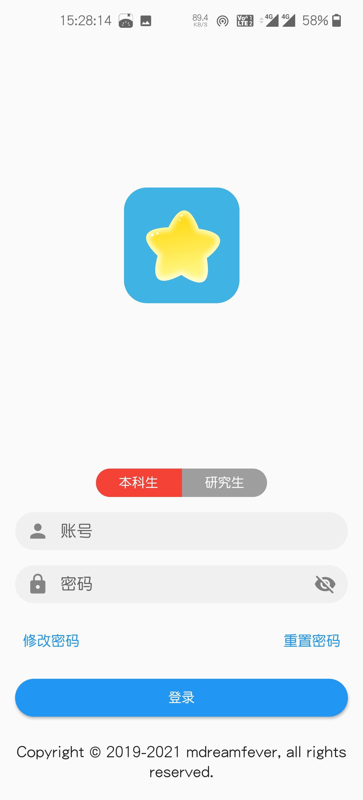
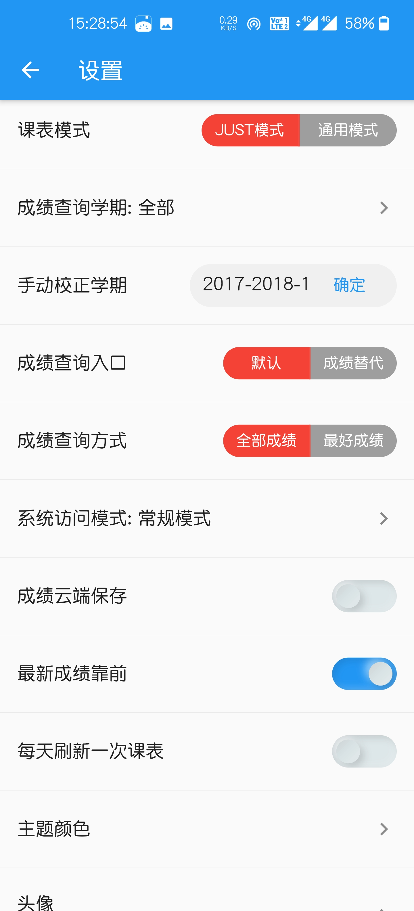
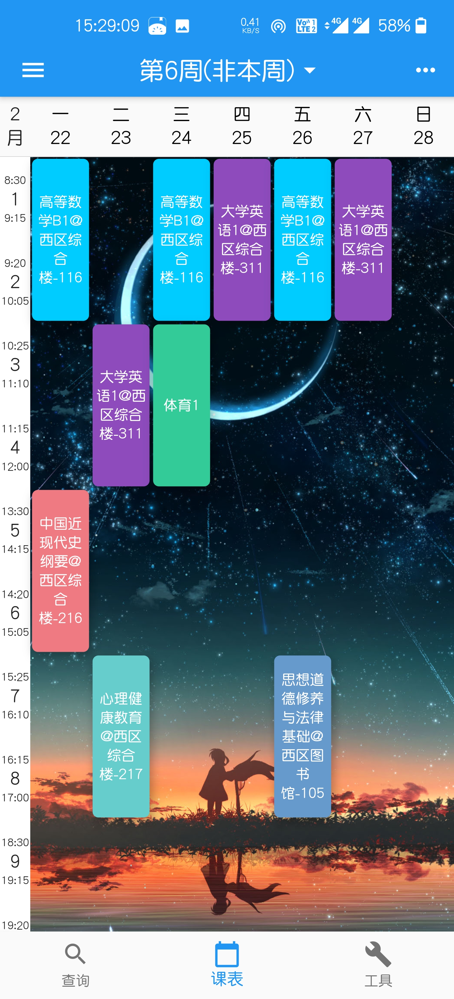
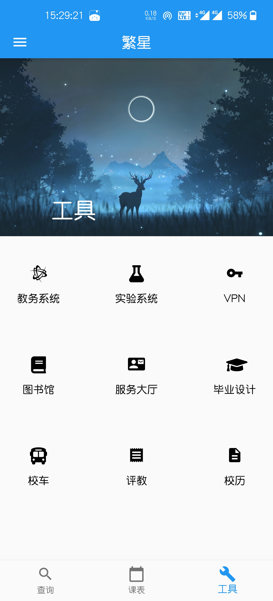

# FStar 繁星课程表

## 简介

繁星课程表是一款课程表软件，采用Flutter框架开发，包含通用模式和江苏科技大学专有模式

### 通用模式

通用模式采用内置浏览器定位到教务系统课表页执行JavaScript解析函数的方法导入课表

### JUST模式

开发者为江苏科技大学教务系统适配的专用模式，包含成绩查询、课表查询、常用工具等功能















## 繁星课程表适配方法

## 如何导入课表

### 在本页配置学校的课表解析函数(右上角)，退出本页点击课表导入通过浏览器进入到学校的教务系统课表页，然后点击Appbar上的导入按钮即可完成导入

## 课表解析函数的编写

### 导入课表需要有该学校的课表解析函数(JavaScript)，该函数可以由该学校的任意一名学生提供，只需要有一点编程基础和CSS选择器知识即可编写；编写之后把解析函数上传到服务器即可共享

## 课程数据结构规定

```json
{
  "name": "MEMS封装技术",
  "id": "06050010b-1",
  "classroom": "12号楼-214(活动)",
  "week": [
    6,
    7,
    8
  ],
  "row": 7,
  "column": 5,
  "rowSpan": 2,
  "teacher": "刘瑞"
}
```

### 以上为标准的JSON结构

> name 课程名称 字符串
>
> id 课程号 字符串
>
> classroom 教室 字符串
>
> week 课程周数 整型数组
>
> row 课程行定位，从1开始，表示第几小节 数字
>
> column 课程列定位，从1开始，表示星期几 范围1-7 数字
>
> rowSpan 课程跨行，2表示课程横跨两行，相当于两小节 数字
>
> teacher 老师 字符串
>
> 以上字段均不能为null 跨行没有限制，课程可以任意重叠
>

### 发送课表解析结果 调用如下代码将解析结果发送给繁星课程表

    window.flutter_inappwebview.callHandler('postCourse', JSON.stringify({'course': course, 'remark': remark}));

> course是一个课程数组 remark为备注信息，可选，会显示到课表底部

## **注意** 手动填入解析函数的时候要特别注意换行问题，如果没有换行，所有的代码会变成一行，如果代码中带有注释则会出错！

## 解析函数例子

## 以下为江苏科技大学本科生课表解析函数

```
(function () {
    let course = [];
    let trs = document.querySelectorAll('#kbtable tr');
    let remark = trs[trs.length - 1].textContent;//备注
    for (let i = 1; i < trs.length - 1; i++) {
        let contents = trs[i].querySelectorAll('td .kbcontent')
        contents.forEach((value, key) => {
            let c = parse(value.innerHTML, i, key + 1);
            course.push(...c)
        });
    }

    //解析课表
    function parse(content, row, column) {
        let eachContent = content.split(/-{5,}<br>/);
        let result = [];
        eachContent.forEach(value => {
            let regx = /(.*?)<br>(.*?)<br><.*?>(.*?)<\/font>.*?">(.*?)\(周\)/
            let results = regx.exec(value);
            if (results != null) {
                let id = results[1];
                let name = results[2];
                let teacher = results[3];
                let week = parseWeek(results[4]);
                let roomRegx = /<font title="教室">(.*?)<\/font>/
                let roomResult = roomRegx.exec(value)
                let room = roomResult !== null ? roomResult[1] : '';
                let course = {
                    'name': name,
                    'id': id,
                    'classroom': room,
                    'week': week,
                    'row': row * 2 - 1,
                    'column': column,
                    'rowSpan': 2,
                    'teacher': teacher,
                };
                result.push(course);
            }
        });
        return result;
    }

    function parseWeek(rawWeek) {
        let eachPart = rawWeek.split(',');
        let result = [];
        eachPart.forEach(part => {
            if (part.indexOf('-') !== -1) {
                let [begin, end] = part.split('-');
                for (let i = Number(begin); i < Number(end) + 1; i++) {
                    result.push(i);
                }
            } else {
                result.push(Number(part));
            }
        });
        let setResult = new Set(result);
        return Array.from(setResult);
    }
    
    window.flutter_inappwebview.callHandler('postCourse', JSON.stringify({'course': course, 'remark': remark}));
})();
```

## 以下为江苏科技大学研究生课表解析函数

### 预处理函数

### 因为研究生系统含有多个iframe，需要用js代码跳转到课表页的iframe执行课表解析函数才能成功导入课表

```
window.location = 'http://yjsinfo.just.edu.cn/pyxx/pygl/kbcx_xs.aspx';
```

### 课表解析函数

```
(function () {
    let course = [];
    let trs = document.querySelectorAll('#DataGrid1 tr');
    for (let i = 1; i < trs.length; i++) {
          let contents = trs[i].querySelectorAll('td');
          let filterResult = [];
          contents.forEach(value => {
              if (value.innerHTML !== '上午' && value.innerHTML !== '下午' && value.innerHTML !== '晚上') {
                  if (isNaN(parseInt(value.innerHTML))) {
                      filterResult.push(value);
                  }
              }
          })
          filterResult.forEach((value, key) => {
              let rowSpan = value.getAttribute('rowSpan');
              let c = parse(value.innerHTML, i, key + 1, parseInt(rowSpan));
              course.push(...c);
          });
    }

    function parse(content, row, column, rowSpan) {
          let eachContent = content.split(/<br><br>/);
          let result = [];
          eachContent.forEach(value => {
              let regx = /课程:(.*?)<br>班级:(.*?)<br>\((.*?)\)<br>第(.*?)周; <br>主讲教师:(.*?)/
              let results = regx.exec(value);
              if (results != null) {
                  let id = results[2].trim();
                  let name = results[1].trim();
                  let teacher = results[5].trim();
                  let week = parseWeek(results[4]);
                  let room = results[3].trim();
                  let course = {
                      'name': name,
                      'id': id,
                      'classroom': room,
                      'week': week,
                      'row': row,
                      'column': column,
                      'rowSpan': rowSpan,
                      'teacher': teacher,
                  };
                  result.push(course);
              }
          });
          return result;
    }

    function parseWeek(rawWeek) {
          let eachPart = rawWeek.split(',');
          let result = [];
          eachPart.forEach(part => {
              if (part.indexOf('-') !== -1) {
                  let [begin, end] = part.split('-');
                  for (let i = Number(begin); i < Number(end) + 1; i++) {
                      result.push(i);
                  }
              } else {
                  result.push(Number(part));
              }
          });
          let setResult = new Set(result);
          return Array.from(setResult);
    }

    window.flutter_inappwebview.callHandler('postCourse', JSON.stringify({'course': course}));
})();
```

## 开发环境

### 本项目采用的是Flutter的dev分支进行开发的，并非stable分支

```
Doctor summary (to see all details, run flutter doctor -v):
[√] Flutter (Channel dev, 1.25.0-4.0.pre, on Microsoft Windows [Version 10.0.19042.746], locale zh-CN)
[√] Android toolchain - develop for Android devices (Android SDK version 30.0.2)
[√] Chrome - develop for the web
[√] Visual Studio - develop for Windows (Visual Studio Enterprise 2019 16.8.2)
[√] Android Studio (version 4.1.0)
[√] IntelliJ IDEA Ultimate Edition (version 2020.3)
[√] VS Code (version 1.45.1)
[√] Connected device (4 available)
```

## Flutter学习

### [Flutter官网](https://flutter.dev/)

### [Flutter中文网](https://flutterchina.club/)

### [Flutter实战](https://book.flutterchina.club/)
